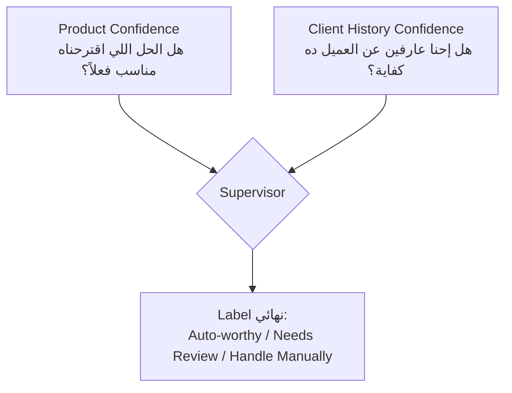
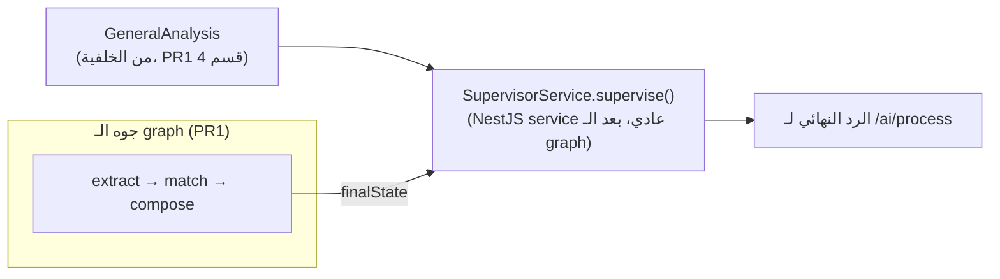
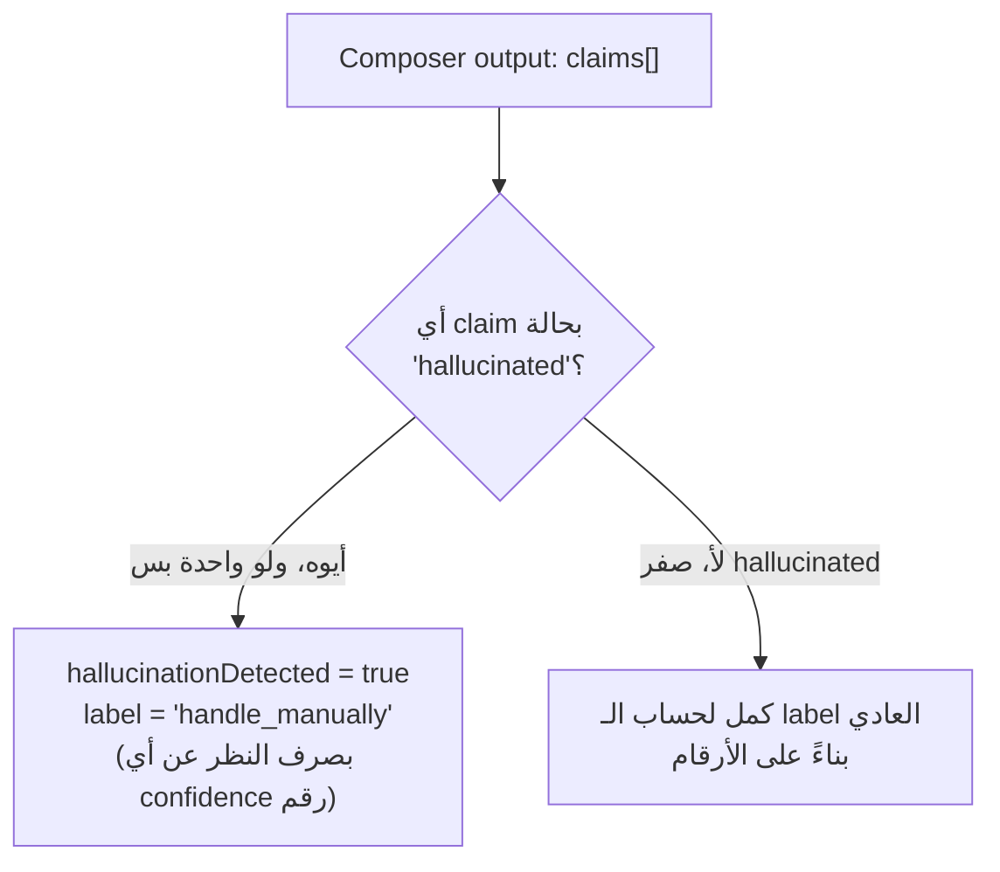
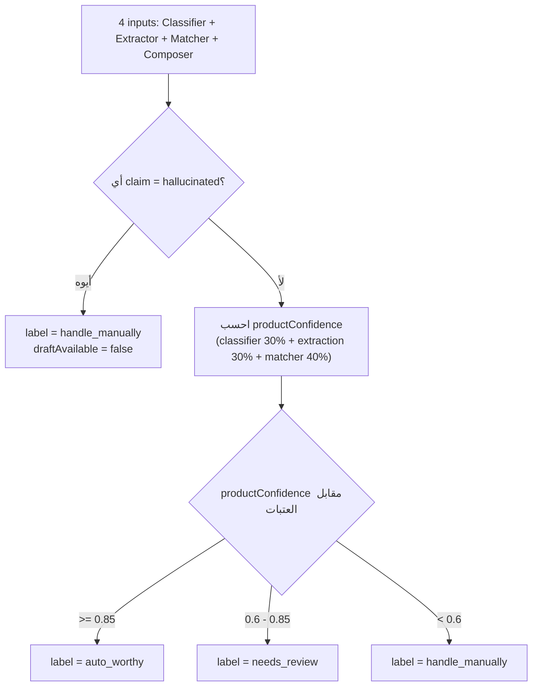

# PR2 — Supervisor Agent: من "4 آراء متفرقة" لـ "قرار واحد واضح: ابعت، راجع، ولا امسك يدوي"

> **الدور:** Mohamed Khaled (Lead) — Role 2B في `AI_Sprint1_Plan.md`
> **المرجع البيزنسي:** `Business_Story_Inbox_Sales_Copilot.md` §7.4, §7.5 — Epic 10 في الباكلوج (Confidence Routing & Safety)
> **الحالة الحالية في الريبو:** `src/modules/ai/supervisor/` **مش موجود لسه** — هنبنيه من الصفر
> **خبر كويس قبل ما تبدأ:** الملف ده **مفيهوش LangChain ولا LangGraph خالص**. الـ Supervisor مش عايز يكلم أي موديل AI — هو بس بيجمع نتايج الأربع agents التانيين ويطبّق عليهم قواعد ثابتة. يعني ده NestJS service عادي 100%، بنفس الأسلوب اللي إنت بنيت بيه أي service في NestJS قبل كده. مفيش حاجة جديدة تتعلمها هنا غير Zod (اللي اتعلمتها في PR1 بالفعل).

---

## 0. إيه اللي إنت فعلاً هتبنيه، وإيه اللي _مش_ هتبنيه

| هتبنيه في PR2                                                  | مش هتبنيه هنا                                                                                                 |
| -------------------------------------------------------------- | ------------------------------------------------------------------------------------------------------------- |
| `supervisor.types.ts` — شكل المدخلات والمخرجات                 | Extractor/Matcher/Composer نفسهم (دول PRs تانية)                                                              |
| `supervisor.schema.ts` — Zod schema للـ output (نفس أسلوب PR1) | تعديل `/ai/process` endpoint (PR3 — الجاي)                                                                    |
| `supervisor.service.ts` — كل منطق الحساب (pure functions)      | أي استدعاء LLM — الـ Supervisor صفر نداءات AI                                                                 |
| `supervisor.module.ts`                                         | حل discrepancy الـ 85%/60% نهائياً من غير ما تسأل الفريق (هنعلّمها كقرار لازم تاخده انت، مش هناخده نيابة عنك) |
| `supervisor.service.spec.ts`                                   | —                                                                                                             |

---

## 1. البداية — ليه مش نكتفي برقم ثقة واحد بس؟

من `Business_Story_Inbox_Sales_Copilot.md` §7.4: الـ AI ممكن يكون **واثق جداً من المنتج** (عارف الحل المناسب 100%) لكن **مش عارف حاجة عن العميل ده تحديداً** (عميل جديد أول مرة يتكلم معاه)، أو العكس (عميل قديم اتكلمنا معاه كتير، بس طلبه النهاردة غامض وملوش حل واضح في الـ KB). **رقم واحد بيدمج الحالتين دول هيضيع المعلومة**: لو حطينا متوسط الاتنين، عميل جديد بطلب واضح جداً هيطلع بنفس رقم عميل قديم بطلب غامض — وده تضليل، لأن كل حالة محتاجة تصرف مختلف تماماً من الـ Sales Engineer.

عشان كده الباكلوج (Epic 10) واضح: **إشارتين منفصلتين**، مش رقم واحد:



وفيه بُعد تالت مختلف تماماً عن الاتنين دول: **هل الرد نفسه فيه معلومة مختلقة (hallucination)؟** ده مش "درجة ثقة" خالص — ده **veto**، سويتش تشغيل/إيقاف. هنشرحه بالتفصيل في قسم 4.

---

## 2. مفهوم أساسي — مش كل "Agent" لازم ينادي موديل AI

فاكر لما اتكلمنا قبل كده عن `assessDocumentQuality` (بتاعة سلمى، بتحدد جودة مستند الـ KB)؟ رجعنا يومها لقينا إنها **دالة حتمية صرفة (pure function)** — بتاخد 3 أرقام (طول النص، حجم الملف، عدد الـ chunks) وترجّع قرار، من غير أي نداء LLM. نفس المبدأ بالظبط ينطبق هنا على الـ Supervisor، ولسبب مشابه: **القرار مبني على أرقام وقواعد جاهزة، مش على "فهم" نص جديد.**

### مثال عام (بعيد عن المشروع) — pure function بسيطة

```typescript
// A GENERIC pure function — no AI call, just rules on numbers
function decideDiscount(loyaltyYears: number, totalSpend: number): number {
  if (loyaltyYears > 5 && totalSpend > 10000) return 0.2; // 20% off
  if (loyaltyYears > 2) return 0.1; // 10% off
  return 0;
}
```

`decideDiscount` مش محتاجة "تفهم" نص حر — هي بس بتطبّق قواعد على أرقام موجودة بالفعل. الـ Supervisor نفس الفكرة، بس القواعد أعقد شوية.

### القرار المعماري: NestJS service عادي، مش LangGraph node

في PR1 اتفقنا إن Extractor/Matcher/Composer لازم يبقوا LangGraph nodes لأنهم **بيتشاركوا state ويتنفذوا بالترتيب جوه نفس الـ request**. الـ Supervisor مختلف: هو **آخر خطوة، بعد ما الـ graph يخلص تماماً**، وهو محتاج كمان مدخل رابع (نتيجة الـ Classifier) اللي أصلاً **مش جزء من الـ reply-graph** (الكلاسيفاير شغال في الخلفية زي ما شرحنا في PR1 قسم 4). يعني أبسط تصميم: دالة خالصة تتنادى **بعد** `graph.invoke()` يخلص، مش node جواه.



#### ✅ الخطوات بالترتيب

1. اعمل المجلد: `mkdir -p src/modules/ai/supervisor`
2. اعمل ملف فاضي `src/modules/ai/supervisor/supervisor.module.ts` — هنملاه في الخطوة الجاية
3. اعمل الكوميت الأول (فاضي، مجرد بداية):

```bash
git checkout -b feat/supervisor-agent
git add -A
git commit -m "chore(supervisor): scaffold supervisor module folder"
```

---

## 3. تعريف شكل البيانات — `supervisor.types.ts`

**رابط رسمي:** لسه بنستخدم Zod زي PR1 — [Zod Documentation](https://zod.dev). مفيش حاجة جديدة هنا غير الاستخدام نفسه على شكل بيانات مختلف.

قبل الكود، خلينا نحدد المدخلات الأربعة بالظبط (كل واحدة جاية من مكان مختلف):

| المدخل            | مصدره                                      | الشكل                                                                                    |
| ----------------- | ------------------------------------------ | ---------------------------------------------------------------------------------------- |
| Classifier output | `GeneralAnalysis` (قاعدة البيانات، مباشرة) | `{ intent: string, intentConfidence: number, isUrgent: boolean }`                        |
| Extractor output  | `graph.invoke()` النهائي (PR1)             | `ExtractorOutput` (زي ما عرّفناه في PR1)                                                 |
| Matcher output    | `graph.invoke()` النهائي (كريم، لسه)       | `{ matchConfidence: number, matchedProductIds: string[] }` (مؤقت، mock لحد ما كريم يخلص) |
| Composer output   | `graph.invoke()` النهائي (عبدالرحمن)       | `{ draftText: string, claims: Claim[] }` (من PR1، `composer.schema.ts`)                  |

```typescript
// src/modules/ai/supervisor/supervisor.types.ts
import { z } from 'zod';

// This is what YOU produce, not an LLM — that's why "reasoning" isn't
// needed here the way it was in ExtractorSchema. There's no model to
// justify itself; the justification IS the code you're about to write.
export const SupervisorOutputSchema = z.object({
  productConfidence: z.number().min(0).max(1),
  clientHistoryConfidence: z.number().min(0).max(1),
  label: z.enum(['auto_worthy', 'needs_review', 'handle_manually']),
  hallucinationDetected: z.boolean(),
  flaggedClaimsCount: z.number().int().min(0),
  draftAvailable: z.boolean(),
  knowledgeGapSuggestion: z.string().nullable(),
});

export type SupervisorOutput = z.infer<typeof SupervisorOutputSchema>;

// The 4 inputs, gathered from 3 different places (see table above)
export interface SupervisorInput {
  classifierOutput: {
    intent: string;
    intentConfidence: number;
    isUrgent: boolean;
  };
  extractorOutput: {
    featuresInferred: boolean;
    constraintsInferred: boolean;
    scaleInferred: boolean;
    budgetInferred: boolean;
    timelineInferred: boolean;
  };
  matcherOutput: {
    matchConfidence: number;
  };
  composerOutput: {
    draftText: string;
    claims: Array<{ status: 'verified' | 'flagged' | 'hallucinated' }>;
  };
  clientHistoryLength: number; // ClientContext.history.length, from PR1's getClientContext
  isNewClient: boolean;
}
```

### شرح سطر بسطر — ليه كل سطر موجود قبل ما نتكلم عن إزاي بيتكتب

- **`import { z } from 'zod';`**
  **ليه:** محتاجين أداة تعرّف شكل بيانات وتتأكد منه وقت التشغيل، مش بس وقت الكتابة (زي ما شرحنا في PR1). **إزاي:** بتستورد المكتبة كلها تحت اسم `z`، وأي method زي `z.string()` جاية من هنا.

- **`export const SupervisorOutputSchema = z.object({...})`**
  **ليه:** عشان أي حد (إنت بعد سنة، أو زميل جديد) يعرف _بالظبط_ شكل الرد اللي الـ Supervisor بيرجّعه، من غير ما يفتح الكود ويدوّر. **إزاي:** `z.object({...})` بيقول "الرد ده object فيه الحقول الجاية دي بالظبط".

- **`productConfidence: z.number().min(0).max(1)`**
  **ليه:** الثقة لازم تكون نسبة من 0 لـ 1 — رقم زي 1.5 أو -0.2 مالوش معنى هنا، فبنمنعه من الأساس. **إزاي:** `.min(0).max(1)` بتحط حد أدنى وأقصى على الرقم؛ لو حد حاول يحط 1.5 هنا، Zod هيرفض ويرمي error وقت التشغيل.

- **`label: z.enum(['auto_worthy', 'needs_review', 'handle_manually'])`**
  **ليه:** الـ label لازم يكون واحدة من 3 قيم بس، مش أي نص حر — لو كتبت `'AutoWorthy'` بالغلط (حرف كبير) في مكان تاني في الكود، TypeScript نفسه هيرفض يبني (compile error) قبل حتى ما تشغّل حاجة. **إزاي:** `z.enum([...])` بتحصر القيم المسموحة في اللستة دي بالظبط.

- **`hallucinationDetected: z.boolean()` و`flaggedClaimsCount: z.number().int().min(0)`**
  **ليه:** الاتنين دول لازم يوصلوا كأرقام/boolean حقيقية، مش نص زي `"true"` أو `"2"` (غلطة شائعة لو الداتا جاية من API خارجي). **إزاي:** `.boolean()` تقبل `true`/`false` بس. `.int()` تقبل أرقام صحيحة بس (مفيش `2.5` claim).

- **`knowledgeGapSuggestion: z.string().nullable()`**
  **ليه:** الحقل ده _ممكن_ ميكونش موجود (لو الـ Matcher لقى منتج مناسب فعلاً، مفيش "فجوة معرفة" نقولها). **إزاي:** `.nullable()` بتسمح للقيمة تكون `null` بجانب النص، من غير ما تخليه `.optional()` (يعني الحقل _لازم_ يكون موجود دايماً، بس ممكن قيمته `null`).

- **`export type SupervisorOutput = z.infer<typeof SupervisorOutputSchema>;`**
  **ليه:** عشان متكتبش الـ interface مرتين (مرة Zod، ومرة TypeScript type) — تكرار بيبقى مصدر أخطاء لو نسيت تحدّث واحدة منهم. **إزاي:** `z.infer<>` بتولّد الـ TypeScript type تلقائي من الـ schema (زي ما شرحنا في PR1 قسم 0.5).

- **`export interface SupervisorInput {...}`**
  **ليه:** ده مش Zod schema — لأن ده مدخل _إحنا_ بنبنيه من داخل الكود (مش رد من موديل AI محتاج تحقق وقت التشغيل)، فـ TypeScript interface عادي كفاية وأخف. **إزاي:** كل حقل هنا هو نوع بيانات جاي من مصدر مختلف — راجع الجدول اللي فوق الكود عشان تعرف كل حقل جاي منين بالظبط.

- **`clientHistoryLength: number; // ClientContext.history.length, from PR1's getClientContext`**
  **ليه:** عايزين نعرف عدد تفاعلاتنا السابقة مع العميل ده، مش تفاصيلها الكاملة — العدد بس كافي لحساب الثقة. **إزاي:** رقم بسيط، بيتحسب بـ `.length` على الـ array اللي `getClientContext` (بتاعت ناجي) بترجّعه.

#### ✅ الخطوات بالترتيب

1. اعمل ملف `src/modules/ai/supervisor/supervisor.types.ts`
2. الصق الكود اللي فوق كامل
3. شغّل `npx tsc --noEmit` للتأكد إن مفيش أخطاء (ممكن يشتكي إنه مش لاقي `ExtractorOutput` أو `Claim` لو حبيت تستوردهم من PR1 — سيبهم كـ inline types زي ما هما فوق دلوقتي، وتقدر توحّدهم بعدين في PR3)
4. اعمل الكوميت:

```bash
git add src/modules/ai/supervisor/supervisor.types.ts
git commit -m "feat(supervisor): define SupervisorInput/Output shapes"
```

---

## 4. مفهوم أساسي — ثقة المنتج (Product Confidence)

### تشبيه بسيط

تخيّل استاذ بيصحح امتحان: عنده معيارين منفصلين — **"هل الطالب فهم المنهج؟"** (مبني على إجاباته) و**"هل عندي معلومات كفاية عن الطالب ده أقيّمه صح؟"** (لو الطالب غايب طول السنة، حتى لو جاوب صح في الامتحان، الاستاذ مش هيبقى واثق قد نفس الطالب اللي حاضر طول الوقت). المعيار الأول هنا هو **Product Confidence**، والتاني هو **Client History Confidence**، وهنشرح كل واحد لوحده.

### الحساب — Product Confidence

بيتجمّع من 3 مصادر، كل واحد بييجي من agent مختلف:

```typescript
// GENERIC illustration first — simple weighted average, not final code yet
function averageThreeSignals(a: number, b: number, c: number): number {
  return (a + b + c) / 3;
}
```

النسخة الحقيقية بتاعتنا مش متوسط بسيط — لازم تاخد في الاعتبار إن **كل استنتاج (inferred) من الـ Extractor بيقلل الثقة شوية**، لأن استنتاج مش نفس تصريح مباشر من العميل:

```typescript
// src/modules/ai/supervisor/supervisor.service.ts — part 1
import { Injectable } from '@nestjs/common';
import { SupervisorInput } from './supervisor.types';

@Injectable()
export class SupervisorService {
  private computeProductConfidence(input: SupervisorInput): number {
    const { classifierOutput, extractorOutput, matcherOutput } = input;

    // Count how many Extractor fields were INFERRED rather than literal.
    // More inference = less certainty about what the client actually meant.
    const inferredFlags = [
      extractorOutput.featuresInferred,
      extractorOutput.constraintsInferred,
      extractorOutput.scaleInferred,
      extractorOutput.budgetInferred,
      extractorOutput.timelineInferred,
    ];
    const inferredCount = inferredFlags.filter(Boolean).length;
    // 5 fields total -> each inferred field costs a small penalty
    const extractionCertainty = 1 - inferredCount * 0.05;

    // Simple weighted blend: classifier's own confidence, the extraction
    // certainty penalty above, and the Matcher's own KB-match confidence.
    const raw =
      classifierOutput.intentConfidence * 0.3 +
      extractionCertainty * 0.3 +
      matcherOutput.matchConfidence * 0.4;

    // Clamp to [0, 1] in case the blend drifts slightly outside bounds
    return Math.min(1, Math.max(0, raw));
  }
}
```

**ليه الأوزان 0.3/0.3/0.4؟** دي مش معادلة رياضية مقدّسة — دي بداية معقولة تقدر تعدّلها بعدين لما يبقى عندك بيانات حقيقية من US-049 (golden dataset evaluation، Epic 11). المهم دلوقتي إنها **شفافة ومكتوبة صراحة**، مش hardcoded في مكان مخفي.

### شرح سطر بسطر

- **`import { Injectable } from '@nestjs/common';`**
  **ليه:** أي كلاس عايز NestJS "يديره" (ينشئه، يحقنه في كلاسات تانية) لازم يقول له كده صراحة. **إزاي:** الـ decorator `@Injectable()` تحت هو اللي بيعمل الإعلان ده، والـ import ده بيجيب الـ decorator نفسه.

- **`import { SupervisorInput } from './supervisor.types';`**
  **ليه:** الـ method جوه محتاجة تعرف شكل المدخل عشان TypeScript يتأكدلك من أي غلطة (زي إنك تكتب `input.extractorOutptu` بالغلط) وقت الكتابة، مش وقت التشغيل. **إزاي:** بتستورد الـ interface اللي عرّفناها في قسم 3.

- **`@Injectable()` فوق الكلاس**
  **ليه:** ده اللي بيخلّي NestJS يعرف إنه يقدر "يحقن" (inject) نسخة من الكلاس ده في أي حاجة تانية محتاجاه (زي `AiModule` في PR3) من غير ما تعمل `new SupervisorService()` يدوي في كل مكان. **إزاي:** decorator بسيط بيتحط فوق تعريف الكلاس مباشرة — نفس الحاجة اللي عملتها في أي service قبل كده في NestJS.

- **`private computeProductConfidence(input: SupervisorInput): number {`**
  **ليه:** الكلمة `private` معناها "الـ method دي تفصيلة داخلية، مفيش حد برّه الكلاس محتاج يناديها مباشرة" — بس `supervise()` (اللي هنبنيها آخر الملف) هي اللي هتناديها من جواه. ده بيخلّي أي حد يقرا الكود يعرف فوراً "دي تفصيلة تنفيذ، مش جزء من الواجهة العامة". **إزاي:** أي method تحطلها `private` قبل اسمها بس.

- **`const { classifierOutput, extractorOutput, matcherOutput } = input;`**
  **ليه:** بدل ما تكتب `input.classifierOutput` و`input.extractorOutput` و`input.matcherOutput` في كل سطر تحت (تكرار مزعج)، بتاخدهم كلهم مرة واحدة في متغيرات قصيرة. **إزاي:** ده اسمه _destructuring_ — بياخد حقول من object ويحطهم في متغيرات منفصلة بنفس الاسم.

- **`const inferredFlags = [...]` (الأربع سطور اللي فيها `extractorOutput.xInferred`)**
  **ليه:** عايزين نعرف "كام حقل من الخمسة اتحسب بالاستنتاج مش بتصريح مباشر" — ده مؤشر مباشر على قد إيه إحنا واثقين من فهمنا لطلب العميل. **إزاي:** بنعمل array فيها الـ boolean بتوع الخمس حقول كلها، عشان نقدر نعدّهم بسهولة في السطر اللي بعده.

- **`const inferredCount = inferredFlags.filter(Boolean).length;`**
  **ليه:** محتاجين رقم واحد (كام حقل true) مش array كامل، عشان نستخدمه في المعادلة. **إزاي:** `.filter(Boolean)` بتسيب بس القيم اللي `true` (بتشيل أي `false`)، و`.length` بيدّيك عدد اللي فضلوا.

- **`const extractionCertainty = 1 - inferredCount * 0.05;`**
  **ليه:** كل حقل مستنتج (مش مصرّح بيه مباشرة) بيقلل ثقتنا شوية — مش كتير، بس ملموس. لو كل الخمس حقول استنتاج، الثقة تنزل بـ 25% (5 × 0.05). **إزاي:** بندي بالسالب: نبدأ من يقين كامل (1) ونطرح منه 0.05 عن كل حقل مستنتج.

- **`const raw = classifierOutput.intentConfidence * 0.3 + extractionCertainty * 0.3 + matcherOutput.matchConfidence * 0.4;`**
  **ليه:** عايزين رقم نهائي واحد بيجمع 3 مصادر ثقة مختلفة، بس مش بنفس الوزن — إدينا ثقة الـ Matcher (هل لقى منتج مناسب فعلاً) وزن أكبر (0.4) لأنها أقرب حاجة لجودة الرد الفعلي. **إزاي:** كل مصدر بيتضرب في نسبته، والمجموع بيطلع رقم واحد.

- **`return Math.min(1, Math.max(0, raw));`**
  **ليه:** لو المعادلة (لأي سبب حسابي) طلعت رقم أكبر من 1 أو أصغر من 0 بالغلط، لازم نحبسه جوه الحدود المسموحة (الـ schema في قسم 3 أصلاً بيرفض أي رقم برّه 0-1). **إزاي:** `Math.max(0, raw)` بيمنع الرقم يقل عن 0، و`Math.min(1, ...)` بيمنعه يزيد عن 1 — الاتنين مع بعض اسمهم "clamping".

#### ✅ الخطوات بالترتيب

1. اعمل ملف `src/modules/ai/supervisor/supervisor.service.ts`
2. ابدأ بالـ import والـ class skeleton، والصق فيه method `computeProductConfidence` اللي فوق بس (هنكمل باقي الـ methods في الأقسام الجاية قبل ما نعمل commit للملف ده)
3. سيب الملف مفتوح — مش هناخد commit دلوقتي، لسه الكلاس ناقص. هنكمله في الأقسام الجاية ونعمل commit واحد شامل في نهاية قسم 6.

---

## 5. مفهوم أساسي — ثقة تاريخ العميل (Client History Confidence)

نفس تشبيه الاستاذ فوق: لو العميل ده أول مرة نتكلم معاه (`isNewClient: true`)، إحنا **مالناش أي مرجعية سابقة** نقيس بيها الرد — الثقة هنا لازم تبقى منخفضة بشكل مبدئي، مش لأن الرد غلط، لكن لأن **مفيش تاريخ يأكد أو ينفي**. لو العميل قديم وعنده تاريخ تفاعلات طويل، الثقة بترتفع لأن عندنا سياق حقيقي نقارن بيه.

```typescript
// src/modules/ai/supervisor/supervisor.service.ts — part 2, add this method
// inside the same SupervisorService class as before

private computeClientHistoryConfidence(input: SupervisorInput): number {
  if (input.isNewClient) {
    // No history at all -> conservative baseline, not zero (a new client
    // isn't automatically "risky", just "unverified")
    return 0.4;
  }

  // More interactions on record -> more confidence, but with diminishing
  // returns (5 interactions is already "well known", no need for 50)
  const historyScore = Math.min(1, input.clientHistoryLength / 5);
  return historyScore;
}
```

### شرح سطر بسطر

- **`private computeClientHistoryConfidence(input: SupervisorInput): number {`**
  **ليه:** ده منطق منفصل تماماً عن ثقة المنتج — عايزين method لوحدها عشان لو حبينا نغيّر طريقة حسابها بعدين، منلمسش حساب المنتج بالغلط. **إزاي:** method تانية جوه نفس الكلاس، بترجع رقم زي أختها.

- **`if (input.isNewClient) { return 0.4; }`**
  **ليه:** لو العميل جديد، مفيش "تاريخ" نقيس بيه أصلاً — مش معنى كده إننا نديله صفر (ده هيبقى ظالم، العميل الجديد مش بالضرورة "مشبوه")، ولا نديله ثقة عالية (ده هيبقى تفاؤل زيادة عن اللزوم من غير أي دليل). **إزاي:** بنرجّع رقم ثابت متوسط (0.4) كـ "نقطة بداية محايدة" — مش قاعدة معقدة، مجرد قيمة افتراضية معقولة.

- **`const historyScore = Math.min(1, input.clientHistoryLength / 5);`**
  **ليه:** لو العميل عنده تفاعلات كتير (5 أو أكتر)، إحنا "عارفينه كويس" ومفيش داعي الثقة تكمل تزيد بلا حدود — 5 تفاعلات كفاية عشان نعتبره "معروف". **إزاي:** بنقسم عدد التفاعلات على 5 (لو عنده 3، الناتج 0.6؛ لو عنده 5، الناتج 1)، و`Math.min(1, ...)` بيمنع الرقم يعدي 1 لو كان عنده مثلاً 20 تفاعل (20/5 = 4، غلط، فبنحبسه عند 1).

#### ✅ الخطوات بالترتيب

1. ارجع لنفس ملف `supervisor.service.ts` اللي فتحته في القسم اللي فات
2. ضيف الـ method `computeClientHistoryConfidence` جوه نفس الكلاس، بعد `computeProductConfidence` مباشرة
3. لسه من غير commit — كمل للقسم الجاي

---

## 6. مفهوم أساسي — الـ Hallucination Gate (Veto مش رقم)

### ليه ده مختلف تماماً عن الاتنين اللي فاتوا

الـ 2 confidence signals فوق دول **مقياس متدرّج** (spectrum) — من 0 لـ 1، فيه درجات وسط. الـ hallucination مختلف: **إما موجود، إما لأ**. لو الـ Composer قال حاجة مختلقة (claim بحالة `hallucinated`)، مفيش "نص ثقة" هنا — الرد ده **لازم يوقف**، بصرف النظر عن أي رقم confidence عالي. ده بالظبط زي فارق checker الإملاء (spell-checker بيدّيك درجة/نسبة أخطاء) عن كاشف كذب (lie detector بيقولك "صح" أو "غلط"، مفيش نص كدبة).



```typescript
// src/modules/ai/supervisor/supervisor.service.ts — part 3, add this method

private detectHallucination(claims: Array<{ status: string }>): boolean {
  return claims.some((claim) => claim.status === 'hallucinated');
}

private countFlaggedClaims(claims: Array<{ status: string }>): number {
  // Flagged = "uncertain, worth a human glance" — NOT a veto like
  // hallucinated. It's tracked separately and never lowers the label
  // on its own (per Business Story §7.5).
  return claims.filter((claim) => claim.status === 'flagged').length;
}
```

### شرح سطر بسطر

- **`private detectHallucination(claims: Array<{ status: string }>): boolean {`**
  **ليه:** عايزين إجابة نعم/لأ بسيطة — "فيه أي جزء مختلق في الرد ولا لأ" — مش رقم أو نسبة، لأن ده veto مش قياس متدرّج (شرحنا الفرق فوق). **إزاي:** بترجع `boolean` بس (`true`/`false`)، مش `number`.

- **`return claims.some((claim) => claim.status === 'hallucinated');`**
  **ليه:** لو **claim واحد بس** من كل الـ claims بتاعت الرد فيه حالة `hallucinated`، الرد كله لازم يتوقف — مش لازم _كل_ الـ claims تكون مختلقة، **واحدة كفاية**. **إزاي:** `.some()` بترجع `true` لو _أي عنصر واحد_ في الـ array حقق الشرط، وتوقف فورًا من غير ما تكمل تفحص الباقي (أسرع من `.filter().length > 0`).

- **`private countFlaggedClaims(claims: Array<{ status: string }>): number {`**
  **ليه:** الـ `flagged` claims مختلفة عن `hallucinated` — مش veto، بس معلومة مفيدة نعرضها للـ SE ("فيه جزء من الرد مش متأكدين منه 100%، يستاهل نظرة"). عايزين _عدد_، مش boolean. **إزاي:** بترجع `number`.

- **`return claims.filter((claim) => claim.status === 'flagged').length;`**
  **ليه:** عايزين نعد كام claim بالظبط بحالة `flagged`، مش بس "فيه ولا لأ". **إزاي:** `.filter()` بتسيب بس اللي حالتهم `flagged` (بتشيل الباقي)، و`.length` بيدّيك العدد.

### ⚠️ قرار لازم تاخده مع الفريق قبل ما تكمل — عتبات الـ label

الميموري بتاعتي عندي بتقول إن فيه **اختلاف موثّق** بين `handoff` والكود الفعلي حول عتبات الـ label: الـ handoff بيحدد **85%/60%**، بينما نسخة من الكود بتستخدم **80%/60%**. الفرق ده لازم يتقفل قبل ما تكتب `computeLabel` النهائية، لأنه رقم حرج بيحدد هل رد بيتبعت أوتوماتيك ولا لأ:

```typescript
// src/modules/ai/supervisor/supervisor.service.ts — part 4, add this method

// ⚠️ DECISION PENDING: confirm these two thresholds with the team against
// CONTRACTS.md before merging this PR. Values below are a PLACEHOLDER
// using the handoff's 85/60 — swap to 80/60 only if the team confirms
// that's the intentionally updated number, not a stale leftover.
private readonly PRODUCT_CONFIDENCE_AUTO_THRESHOLD = 0.85;
private readonly PRODUCT_CONFIDENCE_REVIEW_THRESHOLD = 0.6;

private computeLabel(
  productConfidence: number,
  hallucinationDetected: boolean,
): 'auto_worthy' | 'needs_review' | 'handle_manually' {
  // The veto ALWAYS wins first, before any number is even looked at.
  if (hallucinationDetected) {
    return 'handle_manually';
  }
  if (productConfidence >= this.PRODUCT_CONFIDENCE_AUTO_THRESHOLD) {
    return 'auto_worthy';
  }
  if (productConfidence >= this.PRODUCT_CONFIDENCE_REVIEW_THRESHOLD) {
    return 'needs_review';
  }
  return 'handle_manually';
}
```

### شرح سطر بسطر

- **`private readonly PRODUCT_CONFIDENCE_AUTO_THRESHOLD = 0.85;`**
  **ليه:** الرقم ده بيتقارن بيه في أكتر من مكان محتمل بعدين، وبيمثّل قرار بيزنس حقيقي (مش تفصيلة تقنية) — عشان كده بنحطه كـ _ثابت مسمّى_ بدل ما نكتب `0.85` مباشرة جوه شرط الـ `if`. لو حد فتح الكود بعد سنة، الاسم `PRODUCT_CONFIDENCE_AUTO_THRESHOLD` بيشرح نفسه، بعكس رقم عايم مالوش سياق. **إزاي:** `private readonly` معناها "متغيّر داخلي، وقيمته متتغيرش بعد ما الكلاس يتبني" — حماية من إنك (أو زميل) تغيّرها بالغلط في مكان تاني في الكود.

- **`private computeLabel(productConfidence: number, hallucinationDetected: boolean): 'auto_worthy' | 'needs_review' | 'handle_manually' {`**
  **ليه:** الـ method دي بتاخد بالظبط المدخلين اللي هي محتاجاهم بس (مش الـ `input` الكامل) — ده اسمه "أقل امتياز ممكن" (least privilege): لو method مش محتاجة تشوف كل حاجة، متدّهاش كل حاجة. **إزاي:** نوع الإرجاع نفسه هو الـ union type بتاع الـ 3 قيم المسموحة (نفس القيم اللي في الـ Zod enum بالظبط — لازم يتطابقوا).

- **`if (hallucinationDetected) { return 'handle_manually'; }`**
  **ليه:** ده أول سطر جوه الدالة، مش صدفة — **الترتيب هنا هو المنطق نفسه**. لو الشرط ده اتحقق، الدالة بترجع فورًا ومتكملش تشوف أي رقم confidence خالص. ده بالظبط معنى "veto": مفيش رقم عالي يقدر "يشتري" تجاوز الـ hallucination. **إزاي:** `return` بتوقف تنفيذ الدالة فورًا لحظة ما بتتنفذ — أي سطر بعدها في الدالة مبيتنفذش خالص في الحالة دي.

- **`if (productConfidence >= this.PRODUCT_CONFIDENCE_AUTO_THRESHOLD) { return 'auto_worthy'; }`**
  **ليه:** لو عدّينا من فحص الـ hallucination (يعني مفيش)، دلوقتي نبص على الرقم — لو عالي جداً (85% فأكتر)، الرد يستاهل يتبعت أوتوماتيك من غير مراجعة بشرية. **إزاي:** `this.PRODUCT_CONFIDENCE_AUTO_THRESHOLD` — لاحظ `this.` قبل اسم الثابت، لأنه معرّف كـ property جوه الكلاس (السطر اللي فات)، مش متغيّر عادي في نفس الدالة.

- **`if (productConfidence >= this.PRODUCT_CONFIDENCE_REVIEW_THRESHOLD) { return 'needs_review'; }`**
  **ليه:** لو الرقم مش عالي كفاية للأوتوماتيك، بس لسه معقول (60% لـ 85%)، الرد يستاهل "مراجعة سريعة من الـ SE" مش رفض كامل. **إزاي:** نفس فكرة السطر اللي فات، بس بعتبة أقل.

- **`return 'handle_manually';` (آخر سطر)**
  **ليه:** لو مفيش أي شرط من الشروط اللي فاتت اتحقق (يعني الرقم أقل من 60%)، دي الحالة الافتراضية الأكثر أماناً — لو مش متأكدين، خلّي إنسان يتعامل معاها يدوي. **إزاي:** ده الـ fallback النهائي، بيتنفذ بس لو كل الـ `if` اللي فاتوا فشلوا.

#### ✅ الخطوات بالترتيب — دلوقتي هنقفل الملف ونعمل أول commit حقيقي له

1. تأكد إن `supervisor.service.ts` دلوقتي فيه الـ 4 methods بالترتيب: `computeProductConfidence`, `computeClientHistoryConfidence`, `detectHallucination`, `countFlaggedClaims`, `computeLabel`
2. شغّل `npx tsc --noEmit` — لازم يعدي من غير أخطاء
3. **قبل الكوميت:** افتح رسالة/تيكيت للفريق (أو كلّم كريم/عبدالرحمن مباشرة) بالسؤال ده بالظبط: "العتبات 85/60 ولا 80/60؟ الـ handoff بيقول حاجة والكود بيقول حاجة تانية." متكملش من غير إجابة واضحة، لأن الرقم ده هيحدد فعلياً هل رد بيتبعت للعميل أوتوماتيك ولا لأ
4. لما تاخد الإجابة، ثبّت الرقمين النهائيين في `PRODUCT_CONFIDENCE_AUTO_THRESHOLD`/`PRODUCT_CONFIDENCE_REVIEW_THRESHOLD`
5. اعمل الكوميت:

```bash
git add src/modules/ai/supervisor/supervisor.service.ts
git commit -m "feat(supervisor): implement confidence calc, hallucination gate, and label routing"
```

---

## 7. تجميع الـ Output الكامل + `SupervisorModule`

دلوقتي نبني الـ method العامة اللي بتنادي كل الـ methods الخاصة اللي بنيناهم، وتجمعهم في `SupervisorOutput` واحد:

```typescript
// src/modules/ai/supervisor/supervisor.service.ts — part 5, the PUBLIC entry point
// add this method to the same class, it's the only one other files will call

supervise(input: SupervisorInput): SupervisorOutput {
  const productConfidence = this.computeProductConfidence(input);
  const clientHistoryConfidence = this.computeClientHistoryConfidence(input);
  const hallucinationDetected = this.detectHallucination(input.composerOutput.claims);
  const flaggedClaimsCount = this.countFlaggedClaims(input.composerOutput.claims);
  const label = this.computeLabel(productConfidence, hallucinationDetected);

  return {
    productConfidence,
    clientHistoryConfidence,
    label,
    hallucinationDetected,
    flaggedClaimsCount,
    // A hallucinated draft is never shown to the SE as-is
    draftAvailable: !hallucinationDetected,
    // Placeholder for now — a real "no product matched well" message
    // wiring depends on Karim's Matcher output shape, not yet finalized
    knowledgeGapSuggestion:
      input.matcherOutput.matchConfidence < 0.3
        ? 'No strong product match found — consider adding KB coverage for this request type'
        : null,
  };
}
```

### شرح سطر بسطر

- **`supervise(input: SupervisorInput): SupervisorOutput {` (من غير `private`)**
  **ليه:** دي الـ method الوحيدة اللي أي كود تاني (PR3 بعدين) هيناديها — كل الـ methods التانية (`computeProductConfidence` وأخواتها) تفاصيل داخلية محجوبة عنه (`private`). ده اسمه "واجهة عامة صغيرة، تفاصيل داخلية مخفية" — نفس فكرة أي service NestJS عملته قبل كده. **إزاي:** من غير كلمة `private` قبلها، الـ method دي متاحة من برّه الكلاس.

- **الأربع سطور `const productConfidence = this.compute...`**
  **ليه:** بدل ما نكرر كل الحسابات دي جوه method واحدة ضخمة، كل حساب في method لوحده (زي ما بنينا فوق) — وهنا بس بنناديهم بالترتيب ونجمع نتايجهم. ده بيخلي كل جزء _قابل للاختبار لوحده_ (شفنا ده في قسم 8) وسهل تتبع أي غلطة. **إزاي:** `this.computeProductConfidence(input)` بتنادي الـ method بتاعت نفس الكلاس، وبتحفظ النتيجة في متغيّر بنفس اسمها تقريباً عشان يبقى واضح.

- **`const label = this.computeLabel(productConfidence, hallucinationDetected);`**
  **ليه:** لاحظ إن السطر ده جاي **بعد** حساب الاتنين دول، مش قبلهم — لأن `computeLabel` محتاجة نتايجهم كمدخل. الترتيب هنا مش تعسفي، هو انعكاس لترتيب الاعتماد المنطقي بين الحسابات. **إزاي:** بتمرر القيمتين اللي حسبتهم فوق كـ parameters.

- **`return { productConfidence, clientHistoryConfidence, label, ... };`**
  **ليه:** دلوقتي عندنا كل القطع منفصلة في متغيرات، ومحتاجين نجمعهم في object واحد بالشكل اللي `SupervisorOutputSchema` (قسم 3) بيتوقعه بالظبط. **إزاي:** لاحظ إن كل اسم هنا (`productConfidence:`) هو نفسه اسم المتغيّر اللي جاي منه — ده اختصار في JavaScript/TypeScript، `{ productConfidence }` معناها `{ productConfidence: productConfidence }`.

- **`draftAvailable: !hallucinationDetected,`**
  **ليه:** لو فيه hallucination، الرد مينفعش يتعرض للـ SE أصلاً كـ "جاهز" — لازم يبقى `false`. **إزاي:** علامة التعجب `!` بتعكس الـ boolean (بتحوّل `true` لـ `false` والعكس)، فلو `hallucinationDetected` هي `true`، الناتج هنا `false`.

- **`knowledgeGapSuggestion: input.matcherOutput.matchConfidence < 0.3 ? '...' : null,`**
  **ليه:** لو الـ Matcher نفسه مش لاقي منتج مناسب (ثقته أقل من 30%)، ده مؤشر مفيد نديه للـ Admin بعدين: "الـ KB ناقصها تغطية لنوع الطلبات دي". لو الثقة كويسة، مفيش داعي للاقتراح ده. **إزاي:** ده اسمه _ternary operator_ — بصيغة `condition ? valueIfTrue : valueIfFalse`. اقرأها كده: "لو `matchConfidence < 0.3`، خد النص ده، وإلا خد `null`".

- **`export class SupervisorModule {}` مع `@Module({ providers: [...], exports: [...] })`**
  **ليه:** أي service في NestJS لازم يكون "مُسجّل" جوه Module عشان الـ framework يعرف يبنيه ويحقنه فين. الـ `exports` تحديداً مهمة هنا لأن `AiModule` (في PR3) محتاج "يستعير" الـ `SupervisorService` ده — من غير `exports`، هيفضل حبيس جوه `SupervisorModule` بس. **إزاي:** نفس بالظبط الـ pattern اللي شفته في أي module NestJS عملته قبل كده — مفيش جديد هنا خالص.

**رابط توثيقي لـ `@Injectable()` نفسها** لو حابب تراجع فلسفة الـ Dependency Injection في NestJS: [NestJS — Providers](https://docs.nestjs.com/providers).

```typescript
// src/modules/ai/supervisor/supervisor.module.ts
import { Module } from '@nestjs/common';
import { SupervisorService } from './supervisor.service';

@Module({
  providers: [SupervisorService],
  exports: [SupervisorService], // so AiModule (PR3) can inject it
})
export class SupervisorModule {}
```

#### ✅ الخطوات بالترتيب

1. ارجع لـ `supervisor.service.ts` وضيف method `supervise` اللي فوق — ده آخر method في الكلاس
2. اعمل ملف جديد `src/modules/ai/supervisor/supervisor.module.ts` والصق فيه الكود
3. شغّل `npx tsc --noEmit`
4. اعمل الكوميت:

```bash
git add src/modules/ai/supervisor/supervisor.service.ts \
        src/modules/ai/supervisor/supervisor.module.ts
git commit -m "feat(supervisor): assemble full SupervisorOutput and export SupervisorModule"
```

---

## 8. الاختبارات — ميزة كبيرة هنا: صفر mocking

**رابط رسمي:** [Jest — Getting Started](https://jestjs.io/docs/getting-started). بما إن `SupervisorService` صفر استدعاءات خارجية (مفيش AI، مفيش database، مفيش S3)، الاختبارات هنا **أسهل بكتير** من PR1 — مفيش أي `jest.fn()` ولا mock خالص، بس بيانات جاهزة (fixtures) وتتأكد من النتيجة:

```typescript
// src/modules/ai/supervisor/supervisor.service.spec.ts
import { SupervisorService } from './supervisor.service';
import { SupervisorInput } from './supervisor.types';

function makeInput(overrides: Partial<SupervisorInput> = {}): SupervisorInput {
  return {
    classifierOutput: {
      intent: 'product inquiry',
      intentConfidence: 0.9,
      isUrgent: false,
    },
    extractorOutput: {
      featuresInferred: false,
      constraintsInferred: false,
      scaleInferred: false,
      budgetInferred: false,
      timelineInferred: false,
    },
    matcherOutput: { matchConfidence: 0.9 },
    composerOutput: {
      draftText: 'Sample reply',
      claims: [{ status: 'verified' }],
    },
    clientHistoryLength: 5,
    isNewClient: false,
    ...overrides,
  };
}

describe('SupervisorService', () => {
  const service = new SupervisorService();

  it('routes a high-confidence, no-hallucination case to auto_worthy', () => {
    const result = service.supervise(makeInput());
    expect(result.label).toBe('auto_worthy');
    expect(result.hallucinationDetected).toBe(false);
  });

  it('ALWAYS forces handle_manually when a claim is hallucinated, regardless of confidence', () => {
    const result = service.supervise(
      makeInput({
        composerOutput: {
          draftText: 'Sample reply',
          claims: [{ status: 'hallucinated' }],
        },
      }),
    );
    expect(result.label).toBe('handle_manually');
    expect(result.draftAvailable).toBe(false);
  });

  it('gives a new client a conservative baseline history confidence, not zero', () => {
    const result = service.supervise(
      makeInput({ isNewClient: true, clientHistoryLength: 0 }),
    );
    expect(result.clientHistoryConfidence).toBe(0.4);
  });

  it('counts flagged claims without letting them override the label alone', () => {
    const result = service.supervise(
      makeInput({
        composerOutput: {
          draftText: 'Sample reply',
          claims: [{ status: 'flagged' }, { status: 'verified' }],
        },
      }),
    );
    expect(result.flaggedClaimsCount).toBe(1);
    expect(result.label).toBe('auto_worthy'); // flagged alone doesn't force a downgrade
  });
});
```

### شرح سطر بسطر

- **`function makeInput(overrides: Partial<SupervisorInput> = {}): SupervisorInput {`**
  **ليه:** كل اختبار محتاج `SupervisorInput` كامل (فيه 6 حقول)، بس كل اختبار عايز يغيّر حقل واحد بس (زي `isNewClient`). لو كتبت الـ object الكامل من الصفر في كل `it()`، هيبقى تكرار مزعج وصعب المتابعة. **إزاي:** الدالة دي بترجع "نسخة افتراضية سليمة" (كل حاجة confident وواضحة)، وبتقبل `overrides` (حقول تحب تغيّرها) تدمجها فوقها.

- **`...overrides,` (آخر سطر جوه الـ `return {}`)**
  **ليه:** ده اللي بيخلّي التخصيص (override) يشتغل فعلاً — لازم يكون **آخر سطر** جوه الـ object. **إزاي:** ده اسمه _spread operator_ — بياخد كل حقول `overrides` ويحطهم جوه الـ object، وبما إنه آخر سطر، أي حقل موجود فيه بيستبدل نفس الحقل اللي فات فوق (JavaScript بتاخد آخر قيمة لنفس المفتاح).

- **`describe('SupervisorService', () => { ... });`**
  **ليه:** ده "تجميعة" منطقية — كل الاختبارات اللي جوّاها بتتكلم عن نفس الكلاس. لو فتحت نتيجة الاختبارات، هتلاقي اسم `SupervisorService` ظاهر كعنوان يجمع كل اللي جواه. **إزاي:** أول parameter اسم التجميعة، وتاني parameter دالة فيها الاختبارات.

- **`const service = new SupervisorService();`**
  **ليه:** بما إن `SupervisorService` معندهاش أي dependency في الـ constructor بتاعها (زي ما شفنا، صفر LLM أو database)، تقدر تعمل `new` ليها مباشرة في الاختبار من غير أي NestJS testing module معقد. **إزاي:** ده استخدام الكلاس زي أي كلاس TypeScript عادي — مفيش سحر NestJS هنا.

- **مثال تفصيلي على أول `it(...)`:**
  - `it('routes a high-confidence, no-hallucination case to auto_worthy', () => {` — **ليه:** اسم الاختبار بيوصف _السيناريو والنتيجة المتوقعة_، مش تفاصيل تقنية — لو فشل الاختبار، تقرا الاسم وتفهم فوراً "إيه اللي المفروض يحصل ومحصلش".
  - `const result = service.supervise(makeInput());` — **ليه:** بننادي الدالة الحقيقية بمدخل افتراضي كامل (كل حاجة confident، مفيش hallucination). **إزاي:** `makeInput()` من غير أي overrides بترجع الحالة "المثالية".
  - `expect(result.label).toBe('auto_worthy');` — **ليه:** عايزين نتأكد إن الحالة المثالية بتوصل فعلاً لأفضل تصنيف. **إزاي:** `expect(x).toBe(y)` بتقارن `x` و`y` بالتساوي الصارم، ولو مش متطابقين الاختبار بيفشل بوضوح.

باقي الاختبارات الثلاثة (hallucination veto، new-client baseline، flagged claims) بنفس البنية بالظبط — بس كل واحدة بتغيّر حقل مختلف في `makeInput({...})` عشان تتأكد من قاعدة مختلفة.

#### ✅ الخطوات بالترتيب

1. اعمل ملف `src/modules/ai/supervisor/supervisor.service.spec.ts`
2. الصق الكود كامل
3. شغّل `npm test -- supervisor.service.spec.ts`
4. لازم تشوف 4 اختبارات ✅ خضرا
5. اعمل الكوميت:

```bash
git add src/modules/ai/supervisor/supervisor.service.spec.ts
git commit -m "test(supervisor): cover routing matrix, hallucination veto, and new-client baseline"
```

---

## 9. Mermaid — خريطة القرار الكاملة



---

## 10. Checklist

- [ ] عتبات الـ label اتقفلت مع الفريق (85/60 ولا 80/60) — مش placeholder لسه
- [ ] Hallucinated claim واحد بس بيفرض `handle_manually` بصرف النظر عن أي رقم
- [ ] Flagged claims بتتعد جوه `flaggedClaimsCount` بس مبتنزلش الـ label لوحدها
- [ ] عميل جديد (`isNewClient: true`) بياخد `clientHistoryConfidence: 0.4`، مش صفر
- [ ] كل الاختبارات pure functions — صفر mocking لأي AI service

---

## 11. إضافة CONTRACTS.md

```markdown
## Supervisor Module

// ── Role 2 · Khaled (Supervisor, AI Phase §2) ─────────────────────────────
supervise(input: SupervisorInput): SupervisorOutput
// Pure, deterministic aggregator — ZERO LLM calls. Runs AFTER reply-graph
// finishes (not a graph node). Combines Classifier's GeneralAnalysis row +
// the graph's final state (extractorResult, matcherResult, composerResult)
// + ClientContext.history.length into one routing decision.
//
// type SupervisorOutput = {
// productConfidence: number; clientHistoryConfidence: number;
// label: 'auto_worthy' | 'needs_review' | 'handle_manually';
// hallucinationDetected: boolean; flaggedClaimsCount: number;
// draftAvailable: boolean; knowledgeGapSuggestion: string | null;
// }
//
// Hallucination is a VETO, not a score: any composer claim with
// status='hallucinated' forces label='handle_manually' regardless of
// productConfidence. Flagged claims are counted but never downgrade the
// label alone. Thresholds: see PRODUCT_CONFIDENCE_AUTO_THRESHOLD /
// PRODUCT_CONFIDENCE_REVIEW_THRESHOLD in supervisor.service.ts — confirmed
// with the team at [DATE], see git blame for the resolution of the
// 85/60 vs 80/60 discrepancy.
```

#### ✅ الخطوات بالترتيب

1. افتح `CONTRACTS.md`
2. دوّر على قسم `## Extractor Module` اللي ضفته في PR1، والصق القسم ده بعده مباشرة
3. عدّل `[DATE]` في التعليق لتاريخ القرار الفعلي بعد ما تتفق مع الفريق
4. احفظ، واعمل الكوميت الأخير:

```bash
git add CONTRACTS.md
git commit -m "docs(supervisor): document the Supervisor contract and threshold decision"
git push origin feat/supervisor-agent
```

الـ PR ده جاهز يتفتح. الخطوة الجاية — PR3، `/ai/process` orchestration — هتربط PR1 وPR2 مع بعض في endpoint واحد حقيقي.

---

## المصادر

1. Zod — Official Documentation: <https://zod.dev>
2. Jest — Getting Started & Mock Functions: <https://jestjs.io/docs/getting-started>
3. NestJS — Providers (Dependency Injection): <https://docs.nestjs.com/providers>
4. `Business_Story_Inbox_Sales_Copilot.md` §7.4 (dual confidence rationale), §7.5 (hallucination as a separate safety gate) — internal project document
